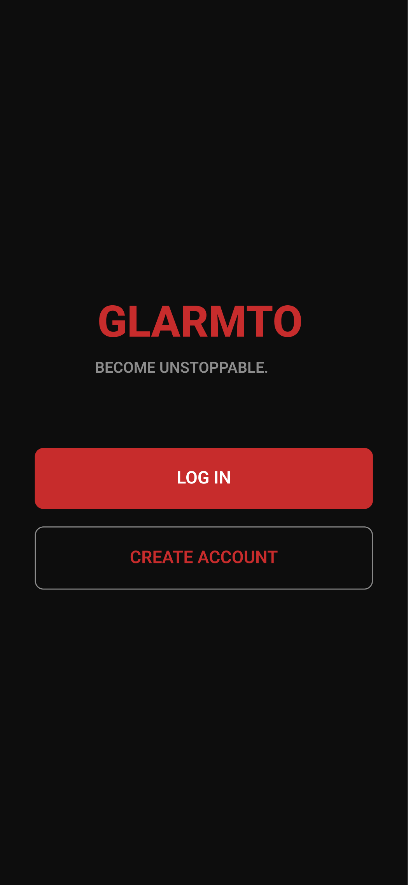
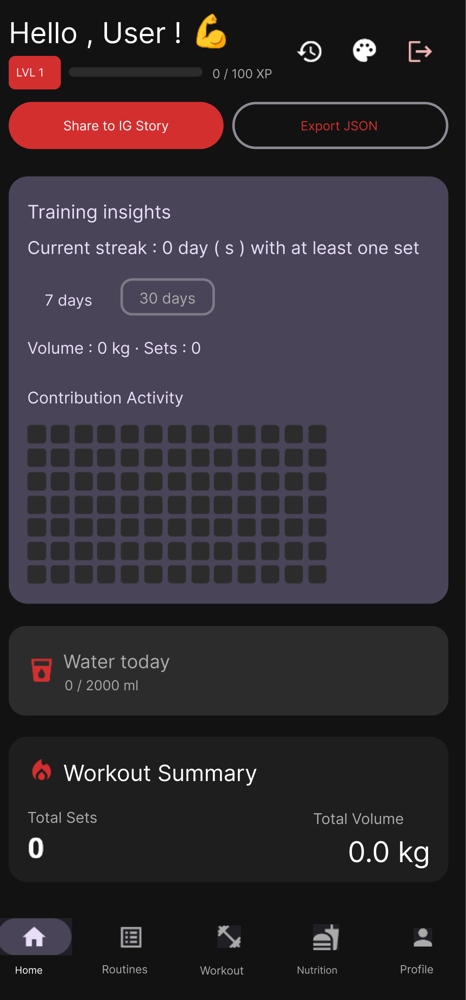
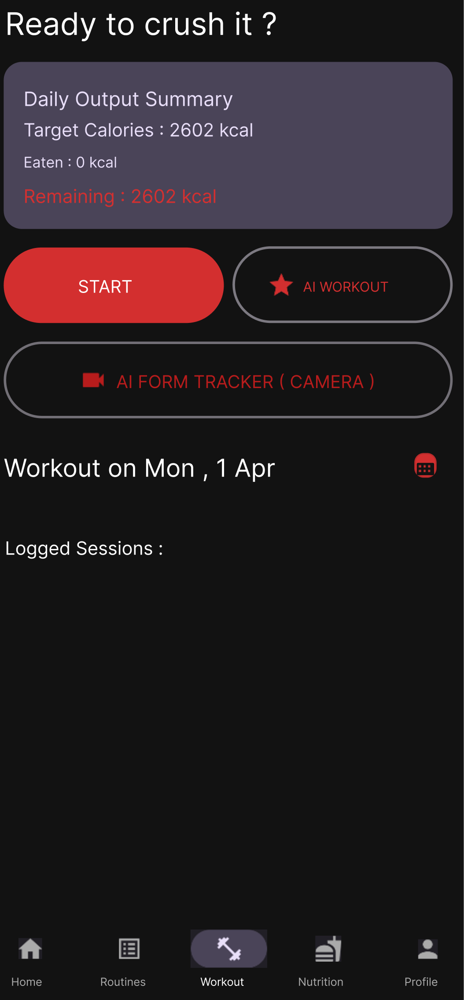
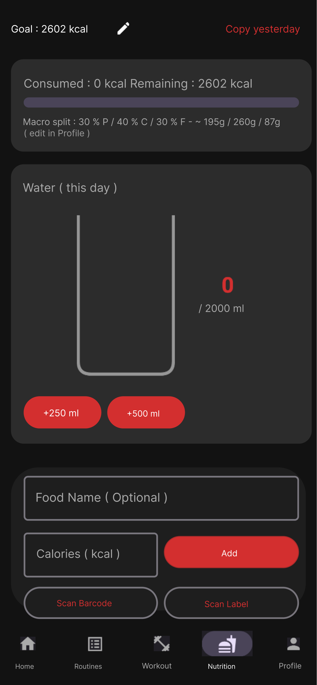
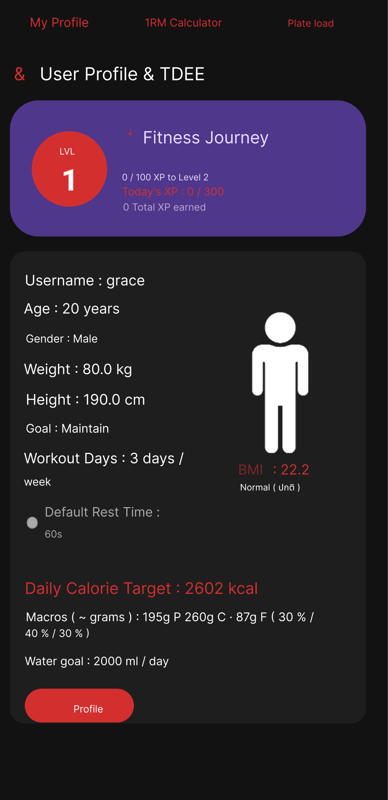
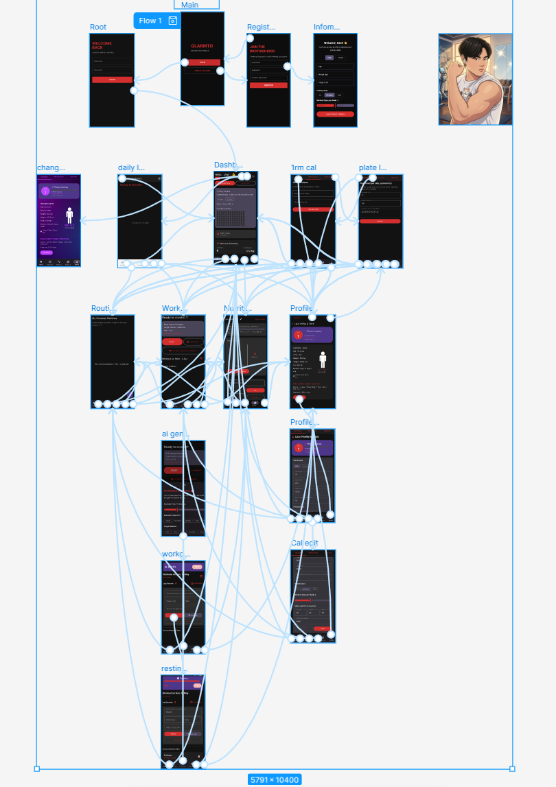

<div align="center">
  
  <h1>💪 GlarmTo (กล้ามโต) - Smart Fitness Companion 🤖</h1>
  <p>The Ultimate AI-Powered Workout Tracker & Gamified Fitness Experience</p>

  <!-- Badges -->
  <p>
    
    
    
    
    
    
  </p>
  
  <h3>
    <a href="https://github.com/Graceiscoming/GlarmTo/releases/latest">
      
    </a>
  </h3>
</div>

---

## 🌟 About The Project (ภาพรวมโปรเจกต์)

**GlarmTo (กล้ามโต)** ไม่ใช่แค่แอปพลิเคชันจดบันทึกการออกกำลังกายธรรมดา แต่เป็น **"ผู้ช่วยส่วนตัวอัจฉริยะ"** ที่รวมเอาเทคโนโลยี **AI** และศาสตร์ของ **Gamification** เข้าด้วยกัน เพื่อลบภาพจำการจดบันทึกที่น่าเบื่อ ให้กลายเป็นการเล่นเกมที่คุณอยากเอาชนะตัวเองในทุกๆ วัน

แอปทำงาน **ออฟไลน์ทั้งหมด** ข้อมูลทุกอย่างเก็บในเครื่อง (ไม่มีเซิร์ฟเวอร์) และใช้ได้ทั้ง **ภาษาไทยและอังกฤษ** สลับได้ในแอปด้วยปุ่มเดียว

เอกสารฉบับนี้จัดทำขึ้นเพื่อแสดงให้เห็นถึง **"ศักยภาพและสถาปัตยกรรมเชิงลึก"** ของแอปพลิเคชัน โดยรวบรวมรายละเอียดฟังก์ชันทั้งหมด โครงสร้างไฟล์ และเทคนิคการเขียนโค้ด เพื่อให้อาจารย์ผู้อ่านสามารถเข้าใจการทำงานของแอปได้ทะลุปรุโปร่งเห็นภาพชัดเจนแม้ไม่ได้ทำการรันโค้ดด้วยตัวเอง

---

## 🔥 Comprehensive Feature List (ฟีเจอร์ทั้งหมดที่แอปทำได้)

แอปพลิเคชันถูกแบ่งออกเป็น 5 หมวดหมู่การใช้งานหลัก ซึ่งครอบคลุมทุกมิติของ Fitness Lifestyle:

### 🤖 1. AI & Smart Technologies (ระบบอัจฉริยะ)
*   🎙️ **Voice-to-Text Workout Logging:** ระบบบันทึกเซ็ตด้วยเสียง เพียงกดไมค์แล้วพูด เช่น *"สควอท 100 กิโล 8 ครั้ง"* ระบบจะใช้อัลกอริทึม NLP ดึงชื่อท่า น้ำหนัก และจำนวนครั้งไปกรอกให้อัตโนมัติ (รองรับคำสั่งภาษาไทยและอังกฤษ และตั้งภาษาเสียงตามภาษาที่เลือกในแอป)
*   📹 **AI Form Tracker (Pose Detection):** ใช้กล้องมือถือสแกนผ่าน **Google ML Kit** เพื่อจับจุดข้อต่อร่างกาย (Skeleton) แบบ Real-time คอยเช็คความลึกของการ Squat และการเคลื่อนไหว
*   🧠 **AI Workout Generator (ออฟไลน์):** สร้างแผนการซ้อมรายวันให้อัตโนมัติตามเวลา อุปกรณ์ และกล้ามเนื้อเป้าหมายที่เลือก โดยฉลาดขึ้นจากประวัติของคุณ:
    - เลี่ยงกล้ามเนื้อที่ยังล้า (ใช้โมเดลความล้าเดียวกับหน้า Recovery) และเสริมกล้ามเนื้อที่สัปดาห์นี้ถูกฝึกน้อย
    - แนะนำน้ำหนักแบบ **Progressive Overload**: ถึงเป้าจำนวนครั้งแล้วเพิ่มน้ำหนักอย่างน้อยหนึ่งช่วงแผ่น ถ้าความก้าวหน้าหยุดนิ่งให้ลดน้ำหนักลง ~10% (Deload)
    - เรียนรู้จังหวะการซ้อมของคุณ (วินาทีต่อเซต, เซตต่อท่า) เพื่อจัดแผนให้พอดีกับเวลา
*   🔥 **AI Calorie Estimate:** ประเมินแคลอรี่ที่เผาผลาญจากโมเดล **Linear Regression** ที่เทรนนอกแอปจากชุดข้อมูลสาธารณะ 15,000 แถว (เพศ, อายุ, ส่วนสูง, น้ำหนัก, ระยะเวลา → R² ≈ 0.93) แล้วฝังค่าสัมประสิทธิ์ไว้ในโค้ด ไม่ต้องใช้ไฟล์โมเดลหรืออินเทอร์เน็ต (สคริปต์เทรนอยู่ที่ `GlarmTo/ml/`)

### 🎮 2. Gamification & Progression (ระบบเกมมิฟิเคชัน)
*   🏅 **Level & XP System:** บันทึกหนึ่งเซต = 10 XP, หนึ่งมื้ออาหาร = 5 XP (สูงสุด 300 XP ต่อวัน) เมื่อหลอดเต็มจะ Level Up เลเวลคำนวณจากตารางเดียวกับที่แสดงบนหน้าจอ ระบบจดว่า **แต่ละเซต/มื้อได้ XP จริงเท่าไร** จึงหักคืนเท่าที่เคยได้เมื่อลบรายการ (เซตที่เกินโควต้าหรือเซตที่คัดลอกมาจะไม่ทำให้ XP หาย)
*   📊 **GitHub-Style Heatmap:** ตารางความขยันจุดสีเขียว ยิ่งซ้อมเยอะสียิ่งเข้ม ช่วยให้ผู้ใช้ติดตามความสม่ำเสมอและเก็บสถิติ Streak (วันซ้อมต่อเนื่อง)
*   📱 **Instagram Story Sharing:** สร้างภาพการ์ดสถิติประจำวัน (มี Level, Streak, แคลอรีเบิร์น) พร้อมพื้นหลังสวยงาม เพื่อแชร์ลง IG Story ได้ในคลิกเดียว (ข้อความบนการ์ดเป็นภาษาที่เลือกในแอป)
*   🎉 **Post-Workout Confetti:** เอฟเฟกต์พลุฉลองความสำเร็จเมื่อซ้อมเสร็จ พร้อมให้ผู้ใช้ประเมินความเหนื่อย (Exhaustion Rating)

### 🏋️ 3. Workout Control (การควบคุมการซ้อม)
*   🕒 **Picture-in-Picture (PiP) Rest Timer:** นาฬิกาจับเวลาพักเซ็ตสุดล้ำที่สามารถ "ย่อเป็นหน้าต่างลอย" (Floating Window) ทับแอปอื่นได้ (ผู้ใช้สามารถไถหน้าจอโซเชียลระหว่างพักเซ็ตได้โดยที่เวลายังคงนับถอยหลังให้เห็น)
*   📈 **Smart Weight Suggestions:** เมื่อพิมพ์ชื่อท่า ระบบดูเซตล่าสุดของท่านั้นและค่า RPE แล้วแนะนำว่าควรเพิ่มน้ำหนัก เพิ่มจำนวนครั้ง หรือคงเดิม
*   📅 **Calendar & History:** ระบบปฏิทินดูประวัติย้อนหลัง ทั้งแบบรายวัน (Daily) ดูรายละเอียดแต่ละเซ็ต และสรุปภาพรวมรายเดือน (Monthly)
*   📝 **Custom Routines:** สามารถสร้างและเซฟแพทเทิร์นตารางฝึกประจำ (เช่น Leg Day) เพื่อให้วันต่อไปกดโหลดรวดเดียวไม่ต้องพิมพ์ใหม่
*   🌙 **ข้ามเที่ยงคืนได้:** ถ้าเปิดแอปค้างไว้ข้ามวัน เมื่อกลับมาที่หน้าจอ แอปจะขยับ "วันนี้" ไปวันใหม่เอง (วันที่ที่คุณเลือกดูย้อนหลังไม่ถูกเปลี่ยน)

### 🧮 4. Advanced Calculators & Nutrition (โภชนาการและการคำนวณ)
*   🍔 **TDEE & Macro Tracker:** คํานวณพลังงานที่ใช้ต่อวันและแจกแจงโควต้า P/C/F (โปรตีน/คาร์บ/ไขมัน) ตามเป้าหมายส่วนบุคคล (ลดไขมัน / รักษาน้ำหนัก / เพิ่มกล้ามเนื้อ)
*   📷 **Barcode & Label Scanner:** สแกนบาร์โค้ดสินค้าด้วย **Google ML Kit (Barcode Scanning)** เพื่อดึงข้อมูลโภชนาการเข้าแอปอัตโนมัติ โดยเชื่อมต่อกับฐานข้อมูลสินค้าไทยกว่า 600+ รายการและ OpenFoodFacts API หรือสแกน **ฉลากโภชนาการ (OCR)** ได้ (ถ้าเป็นข้อมูลต่อ 100g จะระบุไว้ในชื่อ) กล้องจะถูกปิดทันทีเมื่อออกจากหน้าสแกน
*   🌊 **Animated Water Tracker:** ระบบบันทึกการดื่มน้ำที่มาพร้อม "แอนิเมชันคลื่นน้ำ (Wave Effect)" ที่ระดับน้ำจะค่อยๆ เพิ่มสูงขึ้นตามแก้วน้ำจริง
*   💪 **1RM (One-Rep Max) Calculator:** เครื่องมือประเมินระดับความแกร่งสูงสุด (ยกได้หนักสุดกี่กิโล) ด้วยสูตรคณิตศาสตร์ Epley Formula
*   🏋️ **Plate Load Calculator:** เครื่องมือช่วยคำนวณการใส่แผ่นเหล็ก (Plates) บนบาร์เบล ว่าต้องใส่แผ่น 20kg หรือ 10kg ข้างละกี่แผ่นให้ได้น้ำหนักพอดี
*   🔋 **Muscle Recovery Status:** การ์ดบน Dashboard แสดงการฟื้นตัวของกล้ามเนื้อแต่ละส่วน (อก, หลัง, ขา, ไหล่, แขน, แกนกลางลำตัว) โดยแต่ละเซตสร้างความล้า 15% แล้วฟื้นเต็มภายใน 48 ชั่วโมง พร้อมคำแนะนำว่าวันนี้ควรเน้นอะไร

### ⚙️ 5. OS-Level & Utilities (ระบบพื้นฐานและความสวยงาม)
*   🌌 **Dynamic Theming & Glassmorphism:** ธีมแอปพลิเคชัน 5 สไตล์ (Aura, Ocean, Neon, Forest, Blood Red) พร้อมเอฟเฟกต์กระจกโปร่งแสงสุดพรีเมียม
*   🌐 **Language Switch (TH/EN):** ปุ่ม **"TH"** / **"EN"** ที่หน้า Dashboard (ข้างปุ่มธีม) และหน้า Welcome สลับภาษาทั้งแอประหว่างอังกฤษและไทยทันที ไม่ต้องรีสตาร์ท จำค่าที่เลือกไว้ และไม่ขึ้นกับภาษาของเครื่อง (ครั้งแรกตามภาษาเครื่อง) ชื่อท่าออกกำลังกาย ชื่อธีม และชื่อสินค้ายังคงเป็นภาษาเดิม
*   💾 **Local Data Export:** ส่งออกประวัติทั้งหมดเป็นไฟล์ JSON (ปุ่มบน Dashboard) โค้ดรองรับ CSV ด้วย เพื่อเก็บไว้เป็นสำเนา (ยังไม่มีฟังก์ชันนำเข้ากลับ)
*   🔐 **Local Authentication:** ระบบ Login/Register แยกข้อมูลแต่ละ User ภายในเครื่องเดียว รหัสผ่านถูกเก็บแบบ **PBKDF2-HMAC-SHA256 พร้อม salt** (ไม่เก็บรหัสผ่านจริง) บัญชีเก่าที่เคยเก็บรหัสผ่านแบบเดิมจะถูกอัปเกรดให้อัตโนมัติเมื่อ Login ครั้งแรก
*   🛡️ **Privacy:** ปิด Android Auto Backup (`allowBackup=false`) เพื่อไม่ให้ฐานข้อมูลและรหัสผ่านถูกส่งขึ้น cloud backup
*   🚀 **120Hz Smooth UI:** มีการใช้คำสั่งระดับ System ดันเฟรมเรตหน้าจอให้ลื่นไหลสูงสุด เพื่อรีดประสิทธิภาพแอนิเมชันของ Jetpack Compose
*   🧩 **Home Screen Widget:** วิดเจ็ตบนหน้าจอหลักสร้างด้วย Jetpack Glance

---

## 🏗️ Architecture & Project Directory (สถาปัตยกรรมและหน้าที่ของไฟล์)

โปรเจกต์นี้เขียนด้วย **Kotlin** และใช้ **Jetpack Compose** ทั้งหมด โครงสร้างโค้ดถูกออกแบบตามหลัก **MVVM (Model-View-ViewModel)** อย่างเป็นระเบียบ เพื่อให้โค้ดดูแลรักษาง่าย (Maintainable) ไม่ใช้ Hilt/Koin: `GlarmToApplication` เป็นตัวสร้างและเก็บ Database, Repository, SessionManager, ThemeManager และ LanguageManager ส่วน ViewModel สร้างผ่าน Factory ที่เขียนเอง

เพื่อให้เห็นภาพการทำงานเชิงลึก ด้านล่างคือแผนผังหน้าที่ของแต่ละโฟลเดอร์และไฟล์สำคัญ (ไล่จากระดับ Data ไปจนถึง UI):

### 📁 `data/` (Data Layer - ชั้นจัดการข้อมูล)
หน้าที่: จัดการฐานข้อมูล (Local DB) และการประมวลผลลอจิกหนักๆ
*   📂 **`local/` (Room Database)**
    *   `AppDatabase.kt` และ `dao/GlarmToDao.kt`: กำหนด Schema และคำสั่ง SQL (Insert, Query, Delete) ปัจจุบันเป็น **เวอร์ชัน 13** พร้อม Migration เขียนมือต่อกันทุกเวอร์ชัน (ไม่ทำลายข้อมูลเดิมเมื่ออัปเดตแอป)
    *   `entity/`: ไฟล์โครงสร้างตาราง เช่น `UserEntity` (เก็บ XP, เลเวล, รหัสผ่านแบบ hash), `WorkoutEntity` (ชื่อท่า, น้ำหนัก, XP ที่ได้จริง), `NutritionEntity`, `WorkoutSessionEntity`, `RoutineEntity`, `WaterEntity`
*   📂 **`preferences/`**
    *   `SessionManager.kt`: ใช้ SharedPreferences จัดการสถานะ Login
    *   `ThemeManager.kt`: จัดการการเปลี่ยนธีมและอัปเดตแบบ Real-time
    *   `LanguageManager.kt`: จัดการภาษา (TH/EN) จำค่าที่เลือก และสร้าง Context ที่ใช้ข้อความภาษานั้น
*   📂 **`repository/`**
    *   **`GlarmToRepository.kt`**: **(ไฟล์หัวใจสำคัญของการจัดการข้อมูล)** ทำหน้าที่เป็น Single Source of Truth ดึงข้อมูลจาก DAO เพื่อป้อนให้ ViewModel ไฟล์นี้รวมตรรกะที่ซับซ้อน เช่น:
        - ลอจิกการคำนวณ XP (จำกัดโควต้า 300 XP ต่อวัน, หักคืนตาม XP ที่ได้จริง, ป้องกันการอัปเดตชนกันด้วย Mutex) และการ Level Up
        - การสมัคร/ล็อกอินพร้อมตรวจและอัปเกรดรหัสผ่าน
        - อัลกอริทึมการคำนวณ Streak (วันซ้อมต่อเนื่อง) และสถิติช่วง 7/30 วัน
*   📂 **`util/`** (ลอจิกล้วน ทดสอบได้ง่าย ส่วนใหญ่ไม่พึ่ง Android)
    *   **คำนวณ/โมเดล:** `HealthCalculator` (TDEE, มาโคร), `PlateCalculator`, `LevelMath` (เส้นโค้งเลเวล), `RecoveryCalculator` (โมเดลความล้า 48 ชม.), `CalorieBurnModel` (Linear Regression), `PoseAngleMath`, `MuscleBalance`
    *   **AI ออฟไลน์:** `WorkoutGenerator` (สร้างแผนซ้อมและแนะนำน้ำหนัก), `ExerciseLibrary` (รายการท่าและการจัดกลุ่มกล้ามเนื้อ), `ExercisePresets`
    *   **โภชนาการ:** `ThaiProductDatabase`, `OpenFoodFactsApi`, `NutritionOcrParser`, `BarcodeScanGate` (กันสแกนบาร์โค้ดเดิมซ้ำ)
    *   **ระบบ:** `PasswordHasher` (PBKDF2), `TodayTracker` + `CalendarDayUtils` (จัดการ "วันนี้"), `GlarmToExport` (JSON/CSV), `NetworkUtil`
    *   **ข้อความหลายภาษา:** `AppTexts` (ดึงข้อความตามภาษาปัจจุบันให้โค้ดที่ไม่ใช่หน้าจอ), `DisplayNames` (ชื่อกล้ามเนื้อ/อุปกรณ์/เป้าหมายที่แสดงผล)
    *   **`InstagramShareHelper.kt`**: คลาส Helper ที่แยกออกมาเขียนโค้ดวาด Canvas/Bitmap เพื่อแชร์ลง IG โดยเฉพาะ (การแยกไฟล์นี้โชว์ถึงความเข้าใจเรื่อง Single Responsibility Principle เพื่อไม่ให้ ViewModel มีลอจิกของการวาด UI ปนอยู่)

### 📁 `ui/` (Presentation Layer - ชั้นแสดงผล)
หน้าที่: จัดการหน้าจอ UI ทั้งหมดด้วย Jetpack Compose โดยมีการแบ่งโฟลเดอร์ตามฟีเจอร์อย่างชัดเจน
*   📂 **`dashboard/`**
    *   `DashboardScreen.kt`: หน้าแรกสุด รวม Heatmap, กราฟปริมาณรายสัปดาห์, สถิติ 7/30 วัน, การ์ด Recovery, ปุ่มแชร์ IG/ส่งออก, ปุ่มสลับภาษา (TH/EN) และปุ่มเปลี่ยนธีม
    *   **`DashboardViewModel.kt`**: ดึงข้อมูลจาก Repository แล้วแปลงให้อยู่ในรูปแบบ `StateFlow` เพื่อส่งให้ UI อัปเดตข้อมูลแบบ Reactive
*   📂 **`workout/`**
    *   `WorkoutScreen.kt`: หน้าจดบันทึกเซ็ต มีปุ่มไมค์และตัวแยกคำสั่งเสียง (`parseVoiceCommand`) ปุ่มเริ่มจับเวลา และตัวจับเวลาพักแบบ PiP
    *   **`WorkoutViewModel.kt`**: จัดการเซสชันการซ้อม, นาฬิกา, คำแนะนำน้ำหนัก และรวบรวมประวัติส่งให้ตัวสร้างแผน AI
    *   `AiWorkoutGeneratorSheet.kt`, `AiPoseTrackerScreen.kt`, `RecoveryViewModel.kt` / `RecoveryScreen.kt`: ตัวสร้างแผน AI, กล้องจับท่าทาง, และข้อมูลการฟื้นตัว
*   📂 **`camera/`**
    *   `CameraScannerScreen.kt`: สแกนบาร์โค้ด/ฉลากโภชนาการด้วย CameraX + ML Kit
    *   `CameraSession.kt`: เก็บและปิดกล้อง ตัวตรวจจับ ML Kit และเธรด เมื่อออกจากหน้าจอ (ใช้ร่วมกับหน้า AI จับท่าทาง)
*   📂 **`nutrition/` & `calculator/`**
    *   หน้าจอสำหรับกรอกอาหาร (NutritionScreen) ผสมแอนิเมชันคลื่นน้ำ และหน้าจอรวมเครื่องคิดเลข 1RM/Plate Load/TDEE (ที่แท็บ Profile)
*   📂 **`history/` & `routines/` & `login/` & `onboarding/`**
    *   หน้าจอสำหรับดูปฏิทินย้อนหลัง, จัดการเทมเพลตแผนการซ้อม, Login/Register/Welcome และตั้งค่าโปรไฟล์ครั้งแรก
*   📂 **`util/`**
    *   `LanguageProvider.kt`, `LocalizedContext.kt`, `LanguageToggleButton.kt`: ทำให้ทั้งแอปใช้ภาษาที่เลือก (ห่อ Activity ไว้ ไม่ให้ PiP และการขอสิทธิ์กล้องพัง) และปุ่มสลับภาษา
    *   `OnResume.kt`: เรียกคำสั่งทุกครั้งที่หน้าจอกลับมาแสดง (ใช้อัปเดต "วันนี้")
*   📂 **`widget/`** และ **`theme/`**: วิดเจ็ตหน้าจอหลัก และธีม/สี/พื้นหลัง Aura

### 🌐 `res/` (Resources)
*   `values/strings.xml` (อังกฤษ) และ `values-th/strings.xml` (ไทย): ข้อความทั้งหมดของแอปอยู่ที่นี่ (ประมาณ 290 ข้อความ) ไม่ฮาร์ดโค้ดในโค้ด

### 📄 `MainActivity.kt` (Entry Point)
*   **หน้าที่หลัก:** เป็นจุดเริ่มต้นของแอป ทำหน้าที่เป็น Host หลักให้กับ Jetpack Compose ควบคุม **Navigation Graph** (การสลับหน้าไปมา), ห่อทั้งแอปด้วย `LanguageProvider`, ดักจับพฤติกรรมตอนกดยุบแอปเพื่อเข้าสู่โหมด Picture-in-Picture, และมีคำสั่งระดับ OS ในการบังคับจอแสดงผลไปที่ 120Hz เพื่อความสมูทสูงสุด

### 🧠 `GlarmTo/ml/` (Offline Model Training)
*   `train_calorie_model.py` + `calories.csv`: สคริปต์ Python (numpy/pandas) เทรนโมเดลประเมินแคลอรี่ด้วย Linear Regression แล้วพิมพ์ค่าสัมประสิทธิ์ให้นำไปวางใน `CalorieBurnModel.kt` (ทิ้ง Heart Rate กับ Body Temp เพราะแอปไม่มีเซนเซอร์วัด)

---

## 📸 Screenshots & Wireframes

<div align="center">
  
  
  
  
  <br>
  <br>
  
  
  
  
  
  <br>
  <i>ภาพ Wireframe โครงสร้างหน้าจอหลักจากขั้นตอนการออกแบบ (ยังไม่รวมปุ่มสลับภาษา TH/EN ที่เพิ่มภายหลัง)</i>
</div>

> [🔗 คลิกเพื่อดู Figma Wireframe ฉบับเต็มได้ที่นี่](https://www.figma.com/design/J0VdZH5uxkX7j6y8v43CV6/Mobile-app?node-id=0-1&t=lydNLnpRY32mfKTV-1)

---

## 🛠️ Technology Stack & Learning Curve (สิ่งที่เราได้เรียนรู้)

โปรเจกต์นี้เป็นโครงงานเดี่ยวที่มีความท้าทายสูงมาก เนื่องจากมีการศึกษาและเลือกใช้เทคโนโลยีระดับ Modern Android Development ขั้นสูง ที่อยู่นอกเหนือจากเนื้อหาพื้นฐาน:

- **Jetpack Compose**: ย้ายจากระบบ View/XML แบบเก่า มาเขียน UI ด้วยโค้ดแบบ Declarative ช่วยเพิ่มความยืดหยุ่นในการจัดหน้าจอและทำ Animation ได้ลื่นไหล
- **CameraX + Google ML Kit**: ท้าทายอย่างมากในการจัดการ Lifecycle ของกล้อง (ต้องปิดกล้องและตัวตรวจจับเมื่อออกจากหน้าจอ) และการใช้คณิตศาสตร์ดึงพิกัด (X,Y) ของร่างกายมาคำนวณองศาข้อต่อแบบ Real-time
- **Picture-in-Picture (PiP)**: การเขียนให้แอปย่อส่วนเป็นหน้าต่างลอยทะลุกรอบ Lifecycle ปกติ เพื่อแก้ปัญหาผู้ใช้ชอบเล่นมือถือเพลินระหว่างการพักเซ็ต
- **SpeechRecognizer API**: การแปลงเสียงพูดเป็นข้อความและเขียนเงื่อนไข (NLP) เพื่อสกัดชื่อท่า ตัวเลขน้ำหนัก และจำนวนครั้ง ออกมาแยกกรอกลงช่องโดยอัตโนมัติ
- **Room Database & StateFlow**: ใช้ StateFlow ดักฟังความเปลี่ยนแปลงแบบ Reactive ทำให้กราฟและตัวเลขใน Dashboard อัปเดตทันทีที่ผู้ใช้บันทึกเซ็ตใหม่ และเขียน Migration เองต่อกัน 12 ขั้น (ตั้งแต่เวอร์ชัน 1 ถึง 13)
- **Localization (หลายภาษา):** สลับภาษาในแอปโดยไม่ต้องรีสตาร์ทและไม่ขึ้นกับภาษาเครื่อง ด้วย `CompositionLocalProvider` + `ContextWrapper` ที่ห่อ Activity รวมถึงข้อความที่สร้างนอกหน้าจอ (AI, คำแนะนำ) และตั้งค่า App Bundle ไม่ให้ตัดภาษาออก
- **Security พื้นฐาน:** เก็บรหัสผ่านด้วย PBKDF2-HMAC-SHA256 (เขียนบน HMAC เองเพื่อให้ผลเหมือนกันทุกเวอร์ชัน Android และเทียบกับ test vector มาตรฐาน) และปิด Auto Backup
- **Machine Learning แบบเบา:** เทรนโมเดล Linear Regression ด้วย Python แล้วฝังค่าสัมประสิทธิ์ในแอป แทนการใช้ TFLite ที่เกินความจำเป็นสำหรับโมเดลขนาดนี้
- **Automated Testing:** ทดสอบทั้งลอจิกล้วน, ViewModel/Repository (Robolectric), การ migrate ฐานข้อมูลจริง และ UI ของ Compose (ดูหัวข้อถัดไป)

---

## 🧪 Testing (การทดสอบ)

มีเทสต์อัตโนมัติประมาณ **400 ตัว** (ไฟล์เทสต์ 50 กว่าไฟล์ใน `GlarmTo/app/src/test/`) รันบน JVM ไม่ต้องใช้เครื่องหรืออีมูเลเตอร์ ครอบคลุมเช่น:
*   **ลอจิก:** เลเวลและ XP (รวมกรณีอัปเดตพร้อมกัน), ตัวสร้างแผน AI, โมเดลการฟื้นตัว, สูตร TDEE/1RM/Plate, OCR ฉลากโภชนาการ, การส่งออก CSV/JSON
*   **ฐานข้อมูล:** เปิดฐานข้อมูลเวอร์ชัน 12 ที่สร้างเองด้วย Room จริงเพื่อตรวจ Migration ไปเวอร์ชัน 13
*   **ความปลอดภัย:** รหัสผ่านเทียบกับ test vector มาตรฐาน, การอัปเกรดบัญชีเก่า, ปิด Backup, ส่งออกไม่มีรหัสผ่าน
*   **หลายภาษา:** ไฟล์ EN/TH มี key และตัวแปรตรงกัน, เทสต์ที่ **กันไม่ให้มีข้อความฮาร์ดโค้ดกลับเข้ามาในหน้าจอ**, และเทสต์ UI ที่กดปุ่ม TH/EN จริงบนหน้า Welcome/Login/Register/Dashboard แล้วตรวจว่าข้อความเปลี่ยน

รันด้วย `./gradlew testDebugUnitTest` (จากโฟลเดอร์ `GlarmTo`)

---

## 🚀 Getting Started (วิธีการรันและทดสอบ)

### 💡 วิธีที่ 1: ติดตั้งไฟล์ APK
ดาวน์โหลดไฟล์ APK จากแท็บ **[Releases](https://github.com/Graceiscoming/GlarmTo/releases)** (ถ้าผู้พัฒนาได้เผยแพร่เวอร์ชันไว้แล้ว) หรือ Build เองด้วยคำสั่งด้านล่างแล้วติดตั้งไฟล์ที่ได้ลงมือถือ Android:
```bash
cd GlarmTo
./gradlew assembleDebug
# ไฟล์อยู่ที่ app/build/outputs/apk/debug/app-debug.apk
```

### 💻 วิธีที่ 2: รันผ่าน Android Studio
1. Clone โปรเจกต์:
   ```bash
   git clone https://github.com/Graceiscoming/GlarmTo.git
   ```
2. เปิดโปรเจกต์ใน **Android Studio (Jellyfish หรือใหม่กว่า)** โดยเลือกเปิดที่โฟลเดอร์ `GlarmTo` (โฟลเดอร์ชั้นใน ที่มีไฟล์ `gradlew`)
3. รอจังหวะให้ Gradle ทำการโหลดและ Sync ไลบรารีให้สำเร็จ (ครั้งแรกใช้เวลาสักครู่ ใช้ JDK ที่มากับ Android Studio ได้เลย)
4. **แนะนำอย่างยิ่ง** ให้เชื่อมต่อ **สมาร์ทโฟน Android เครื่องจริง** เพื่อรันโปรเจกต์ (แทนการใช้ Emulator) เนื่องจากฟีเจอร์ "กล้อง AI จับท่าทาง" และ "ระบบสั่งการด้วยเสียง" ต้องการเข้าถึงฮาร์ดแวร์จริงเพื่อให้ได้ประสบการณ์สูงสุด
5. กดปุ่ม `Run` (สัญลักษณ์ Play สีเขียว) หรือ `Shift + F10`

### 🌐 การใช้งานภาษา
เปิดแอปแล้วกดปุ่ม **TH** (มุมขวาบนของหน้า Welcome หรือแถวไอคอนบนสุดของหน้า Dashboard) เพื่อเปลี่ยนเป็นภาษาไทย ปุ่มจะเปลี่ยนเป็น **EN** สำหรับกลับเป็นอังกฤษ

---
